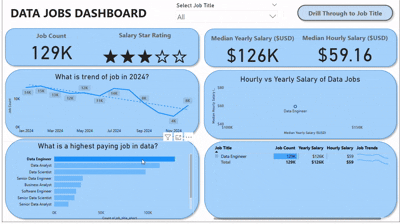
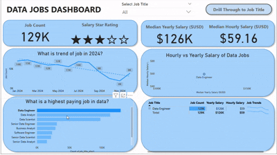
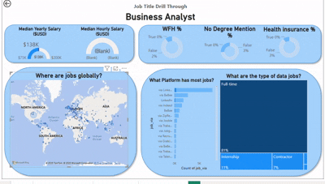

# 📊 Power BI Project 1 – Data Science Job Market Dashboard (2024)

This interactive dashboard was created as part of my **Power BI for Data Analytics** course by [Luke Barousse](https://youtu.be/FwjaHCVNBWA?si=48pPmWfopjy2Lqw-) on YouTube.  
It’s the **first complete project** in the course and focuses on solving a real-world problem faced by **job seekers, job switchers, and career explorers in the data field**.

### 🎯 Problem Statement  
Information about the data job market is often **scattered** across different sources and **hard to grasp**.  
This project brings it all together using a **real dataset of 2024 data science job postings**, including job titles, salaries, locations, and more — all within one powerful, easy-to-use interface.

---

## 📸 Preview

  

---

---

## 🧠 What I Learned & Applied

### ⚙️ Data Preparation (ETL)
- Cleaned and shaped raw CSV data using **Power Query**
- Handled missing values, transformed data types
- Created new calculated columns for better insights

### 🧮 Implicit Measures
- Created measures for **Median Yearly Salary**, **Job Count**, and other KPIs

### 📊 Visualizations
- Column, Bar, Line, and Area Charts for trend & comparison analysis
- **Map Charts** for geo-level job distribution
- **Card Visuals** for high-level KPIs
- **Table Visuals** for sortable, granular job data

### 🖱️ Interactive Reporting Features
- **Slicers** to filter by Job Title  
- **Buttons & Bookmarks** for custom navigation  
- **Drill-Through Pages** to explore deeper context for specific job roles

### 🎨 Dashboard Design
- Designed with user experience in mind  
- Two-page layout:  
  
 ---

##  📄 **Page 1**: High-level overview

  

---

---

## 📄 **Page 2**: Job Title Drill Through

  

---
    
---

## 📚 Course Info

This project is part of:  
🎓 **Power BI for Data Analytics – Full Course for Beginners**  
📺 *By Luke Barousse* → [Watch on YouTube](https://youtu.be/FwjaHCVNBWA?si=48pPmWfopjy2Lqw-)

---

## 🙌 Let’s Connect

Feel free to check out my LinkedIn for more learning updates:  
🔗 [Your LinkedIn Profile](https://www.linkedin.com/in/roshni-kumari2002/)

---

⭐ If you like this project, consider starring the repo and sharing!

